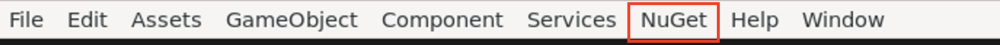
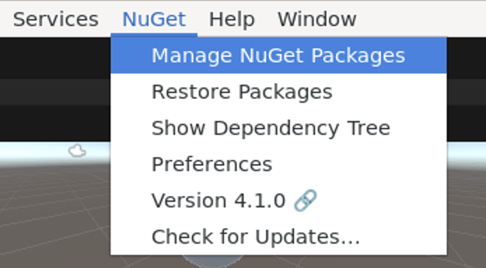
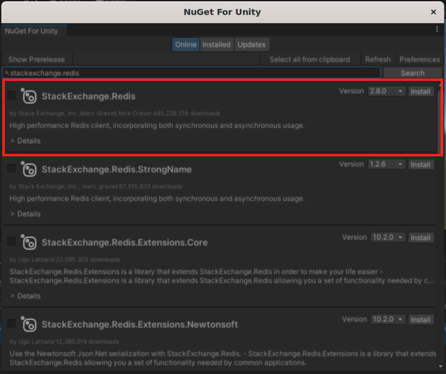

## Working with Redis in Unity
### Getting Started
Make sure Unity is installed and running on your local machine. For more instructions and details, visit Unity's [documentation](https://learn.unity.com/tutorial/install-the-unity-hub-and-editor#).

This guide assumes that you have a Unity project up and running and at least 1 `GameObject` created.

### Requirements
- `Unity 2022.3`
- `StackExchange.Redis`: the client library that we will be using to interface with Redis. 
    - This library is a NuGet library, which is a popular package manager for C#/.NET. However, NuGet is not directly supported in Unity, so we will need to install a NuGet client to run inside of Unity Editor, called `NuGetForUnity`. 
    - In the next section, we will explore how to install `NuGetForUnity`, `StackExchange.Redis`, and any relevant components to get it ready to use in Unity.

### Set up
1. Install `NuGetForUnity` (easiest way):
    - Install the provided Unity package into your Unity project. Located [here](https://github.com/GlitchEnzo/NuGetForUnity/releases).
    - Download the `*.unitypackage` file. Right-click on it in File Explorer and choose "Open in Unity."
    - Once done, you should see a `NuGet` tab in the menu.
    
    
    Note: For other installation options, visit this [here](https://github.com/GlitchEnzo/NuGetForUnity?tab=readme-ov-file#how-do-i-install-nugetforunity)
2. Select `NuGet` -> `Manage NuGet Packages` to open the package manager.
    
3. Search for and install `StackExchange.Redis`. This will install a package in your `Assets/Packages` folder.
     

### Sample Script
This script is an adaptation of Redis' [documentation](https://redis.io/learn/develop/dotnet/streams/stream-basics). 

1. Declare all the necessary namespaces:
    ```
    using System.Collections;
    using System.Collections.Generic;
    using UnityEngine;

    using StackExchange.Redis;
    using System.Threading.Tasks; // required for running the async xrange query
    using System.Linq; // required for parsing Redis stream query results
    ```
2. Initialize the multiplexer:
    
    `StackExchange.Redis` uses the `ConnectionMultiplexer` to handle the commands that you send to Redis. Therefore, the first thing to do is to initialize `ConnectionMultiplexer` and establish a connection to Redis. Once you're connected, the next thing is to grab the correct database in the Redis instance (usually defaulted to database 0).
    ```
    ConnectionMultiplexer redis;
    IDatabase db;

    void Start()
    {
        redis = ConnectionMultiplexer.Connect("localhost");
        db = redis.GetDatabase();
    }
    ```

3. Define a parser helper function:
    
    This function helps parsed all values in a stream entry into a dictionary.
    ```
    Dictionary<string, string> ParseResult(StreamEntry entry) => entry.Values.ToDictionary(x => x.Name.ToString(), x => x.Value.ToString());
    ```

4. Create a XRANGE task and execute it:

    In `StackExchange.Redis`, there are multiple functions that mimic Redis commands, such as `xadd`, `xread`, `xrange`, etc. Each Redis command has 2 functions, one synchronous, and one asynchronous (eg, `StreamRange` and `StreamRangeAsync`). You can learn more about asynchronous programming [here](https://learn.microsoft.com/en-us/dotnet/csharp/asynchronous-programming/), but it is generally recommended to use async since it helps lighter the IO workload.

    ```
    async void Update()
    {
        var streamRangeTask = Task.Run(async() => {
            var key = "supervisor_ipstream";
            var result = await db.StreamRangeAsync(key, "-", "+", 1, Order.Descending);
            if (result.Any())
            {
                foreach (var entry in result)
                {
                    var dict = ParseResult(entry);
                    UnityEngine.Debug.LogFormat("id: {0}", entry.Id);
                    foreach (var ele in dict)
                    {
                        UnityEngine.Debug.LogFormat("key: {0}, value: {1}", ele.Key, ele.Value);
                    }
                }
            }
        });
        
        await Task.WhenAll(streamRangeTask);
    }
    ```
5. Run the script and make sure you see the output in the `Console` panel.

### Troubleshooting
- If your code gives an error "Could not load file or assembly Systeym.Runtime.CompilerServices.Unsafe", install `System.Runtime.CompilerServices.Unsafe` using `NuGetForUnity`.